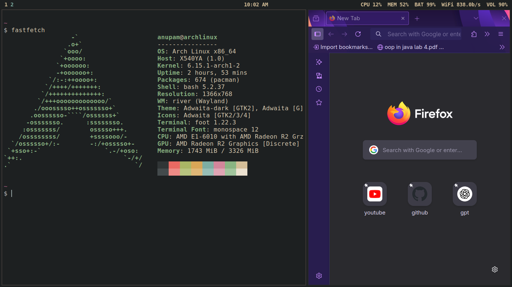
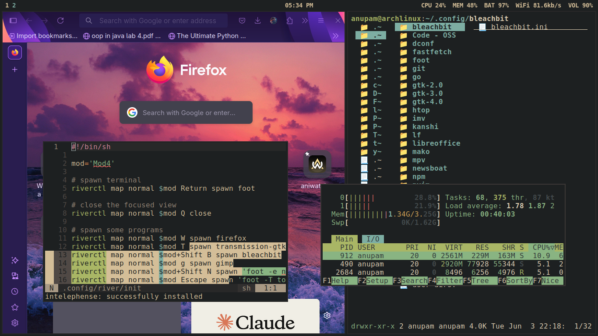
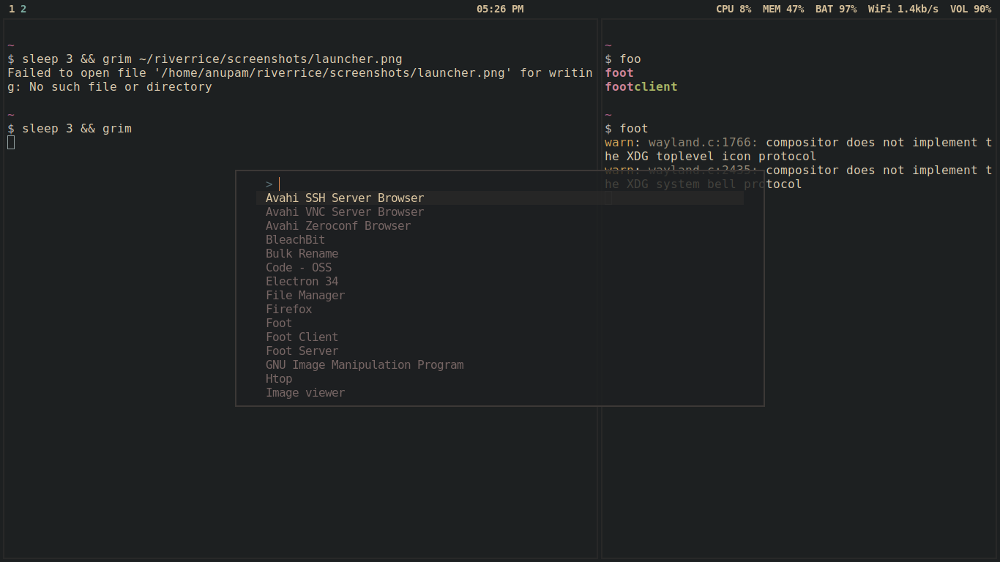

# 🌊 RiverRice - Minimalist Wayland Rice

<div align="center">





*A carefully crafted, minimalist dotfiles collection for the River Wayland compositor*

[Screenshots](#-screenshots) • [Installation](#-installation) • [Features](#-features) • [Keybindings](#-keybindings) • [Troubleshooting](#-troubleshooting)

</div>

## 📸 Screenshots


| Desktop Overview | Application Launcher | Multi-App Workflow |
|:---:|:---:|:---:|
|  |  |  |

## ✨ Features

- **🪟 Dynamic Tiling**: River compositor with intelligent window management
- **🎨 Consistent Theming**: Adwaita theme across all applications
- **⚡ Performance Focused**: Lightweight tools optimized for speed
- **🔒 Security Enhanced**: Hardened Firefox configuration included
- **📱 Modern Wayland**: Full Wayland support with no X11 dependencies
- **🛠️ Extensible**: Modular configuration easy to customize

## 🧩 Components

| Component | Description | Purpose |
|-----------|-------------|---------|
| **[River](https://codeberg.org/river/river)** | Dynamic Wayland compositor | Window management and workspace control |
| **[Waybar](https://github.com/Alexays/Waybar)** | Status bar | System information and workspace indicators |
| **[Foot](https://codeberg.org/foot/foot)** | Terminal emulator | Fast, lightweight terminal with good font rendering |
| **[Fuzzel](https://codeberg.org/dnkl/fuzzel)** | Application launcher | Wayland-native dmenu replacement |
| **[Zathura](https://pwmt.org/projects/zathura/)** | Document viewer | Minimal PDF/document viewer with vim-like keybindings |
| **[Fastfetch](https://github.com/fastfetch-cli/fastfetch)** | System information | System info display with customizable output |
| **[Waylock](https://codeberg.org/ifreund/waylock)** | Screen locker | Simple and secure screen locking |
| **[Tmux](https://github.com/tmux/tmux)** | Terminal multiplexer | Session management and terminal splitting |
| **[Lf](https://github.com/gokcehan/lf)** | File manager | Terminal-based file manager |

## 🚀 Installation

### Prerequisites

Before installing, ensure you have the following:

- **Wayland support** on your system
- **Git** for cloning the repository
- **A compatible Linux distribution** (see [Distribution Support](#distribution-support))

### Quick Install

```bash
# Clone the repository
git clone --depth=1 https://github.com/gomugomucode/riverrice.git ~/riverrice

# Run the installation script
cd ~/riverrice
chmod +x scripts/install.sh
./scripts/install.sh
```

### Manual Installation

If you prefer to install components manually:

```bash
# 1. Clone the repository
git clone https://github.com/gomugomucode/riverrice.git ~/riverrice
cd ~/riverrice

# 2. Copy configuration files
cp -r config/* ~/.config/
cp -r local/* ~/.local/

# 3. Install required packages (see packages file)
# For Arch Linux:
sudo pacman -S river waybar foot fuzzel zathura fastfetch waylock tmux lf

# 4. Set up River as your session
# Add to your display manager or .xinitrc equivalent
```

### Distribution Support

#### Arch Linux
```bash
sudo pacman -S river waybar foot fuzzel zathura fastfetch waylock tmux lf
yay -S <any-aur-packages>  # if needed
```

#### Fedora
```bash
sudo dnf install river waybar foot fuzzel zathura fastfetch waylock tmux lf
```

#### Ubuntu/Debian
```bash
# Some packages may need to be built from source or installed via flatpak
sudo apt install waybar foot zathura tmux
# River and other components may need manual compilation
```

#### NixOS
```nix
# Add to your configuration.nix
environment.systemPackages = with pkgs; [
  river waybar foot fuzzel zathura fastfetch waylock tmux lf
];
```

## ⌨️ Keybindings

### Window Management

| Keybinding | Action |
|------------|--------|
| `Super + Return` | Open terminal (Foot) |
| `Super + Q` | Close focused window |
| `Super + D` | Open application launcher (Fuzzel) |
| `Super + Shift + E` | Exit River |
| `Super + J/K` | Focus next/previous window |
| `Super + Shift + J/K` | Swap windows |
| `Super + H/L` | Decrease/increase main area |
| `Super + Space` | Toggle floating mode |
| `Super + F` | Toggle fullscreen |

### Workspace Navigation

| Keybinding | Action |
|------------|--------|
| `Super + [1-9]` | Switch to workspace N |
| `Super + Shift + [1-9]` | Move window to workspace N |
| `Super + Tab` | Next workspace |
| `Super + Shift + Tab` | Previous workspace |

### System Controls

| Keybinding | Action |
|------------|--------|
| `Super + L` | Lock screen (Waylock) |
| `Super + Shift + R` | Reload River configuration |
| `Print` | Take screenshot |
| `Super + Print` | Take area screenshot |

### Application Shortcuts

| Keybinding | Action |
|------------|--------|
| `Super + E` | File manager (Lf in terminal) |
| `Super + B` | Web browser (Firefox) |
| `Super + V` | Open PDF viewer (Zathura) |

> **Note:** These are default keybindings. Check your `~/.config/river/init` file for the exact configuration.

## 🎨 Customization

### Theming

The setup uses the Adwaita theme for consistency. To change themes:

1. **GTK Theme**: Modify `~/.config/gtk-3.0/settings.ini`
2. **Waybar Theme**: Edit `~/.config/waybar/style.css`
3. **Terminal Colors**: Adjust `~/.config/foot/foot.ini`

### Waybar Customization

Waybar modules can be customized in `~/.config/waybar/config`:

```json
{
    "modules-left": ["river/tags", "river/mode"],
    "modules-center": ["clock"],
    "modules-right": ["pulseaudio", "network", "battery", "tray"]
}
```

### Adding New Applications

To add applications to the Fuzzel launcher:
1. Ensure the application has a `.desktop` file in `/usr/share/applications/`
2. Or create a custom one in `~/.local/share/applications/`

## 📁 Directory Structure

```
riverrice/
├── config/
│   ├── river/           # River compositor configuration
│   ├── waybar/          # Status bar configuration
│   ├── foot/            # Terminal configuration
│   ├── fuzzel/          # Launcher configuration
│   ├── zathura/         # PDF viewer configuration
│   ├── fastfetch/       # System info configuration
│   ├── tmux/            # Terminal multiplexer configuration
│   └── lf/              # File manager configuration
├── local/
│   └── share/           # Local desktop files and resources
├── scripts/
│   ├── install.sh       # Main installation script
│   └── utils/           # Utility scripts
├── screenshots/         # Desktop screenshots
├── packages             # List of required packages
└── README.md           # This file
```

## 🔧 Troubleshooting

### Common Issues

#### River Won't Start
```bash
# Check if River is properly installed
which river

# Check for configuration errors
river -c ~/.config/river/init

# View logs
journalctl --user -u river
```

#### Waybar Not Appearing
```bash
# Test Waybar configuration
waybar -c ~/.config/waybar/config -s ~/.config/waybar/style.css

# Check if Waybar is running
pgrep waybar
```

#### Applications Not Launching
```bash
# Verify XDG environment variables
echo $XDG_CURRENT_DESKTOP
echo $XDG_SESSION_TYPE

# Check if applications are installed
which foot fuzzel zathura
```

#### Font Issues
```bash
# Install required fonts
sudo pacman -S ttf-dejavu ttf-liberation noto-fonts

# Refresh font cache
fc-cache -fv
```

### Performance Issues

If you experience performance problems:

1. **Check graphics drivers**: Ensure proper Wayland drivers are installed
2. **Monitor resource usage**: Use `htop` or `btop` to check system resources
3. **Disable animations**: Reduce Waybar animations in the CSS file
4. **Check compositor settings**: Adjust River's configuration for your hardware

### Configuration Validation

Use these commands to validate your configuration:

```bash
# Check River configuration syntax
river -c ~/.config/river/init -n

# Validate Waybar configuration
waybar --config ~/.config/waybar/config --style ~/.config/waybar/style.css --log-level debug

# Test Foot terminal configuration
foot --config ~/.config/foot/foot.ini --version
```

## 🤝 Contributing

Contributions are welcome! Here's how you can help:

1. **Fork** the repository
2. **Create** a feature branch (`git checkout -b feature/amazing-feature`)
3. **Commit** your changes (`git commit -m 'Add amazing feature'`)
4. **Push** to the branch (`git push origin feature/amazing-feature`)
5. **Open** a Pull Request

### Areas for Contribution

- 📸 **Screenshots**: High-quality desktop screenshots
- 🎨 **Themes**: Additional color schemes and themes
- 📱 **Applications**: Configuration for additional applications
- 🔧 **Scripts**: Automation and utility scripts
- 📚 **Documentation**: Improvements to guides and tutorials
- 🐛 **Bug fixes**: Issue resolution and improvements

## 📄 License

This project is licensed under the MIT License - see the [LICENSE](LICENSE) file for details.

## 🙏 Acknowledgments

- **River Development Team** for creating an excellent Wayland compositor
- **Wayland Community** for advancing the Linux desktop experience  
- **Contributors** who help improve this configuration

## 📞 Support

- **Issues**: [GitHub Issues](https://github.com/gomugomucode/riverrice/issues)
- **Discussions**: [GitHub Discussions](https://github.com/gomugomucode/riverrice/discussions)
- **Matrix**: `#river:matrix.org` (River compositor community)

---

<div align="center">

**Enjoy your minimal Wayland experience! 🌊**

*If you find this configuration helpful, consider giving it a ⭐*

</div>
